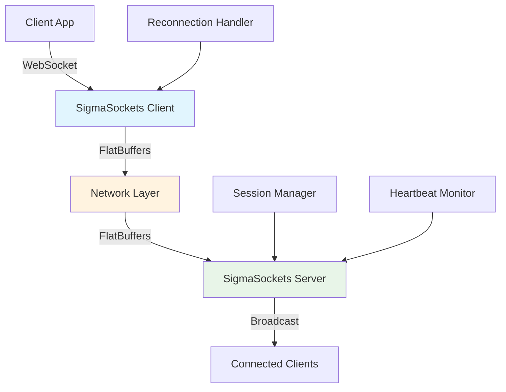

<div align="center">

# 🚀 SigmaSockets

**High-Performance WebSocket System with FlatBuffers Serialization**

[](https://www.npmjs.com/package/sigmasockets-client)
[](https://www.npmjs.com/package/sigmasockets-server)
[](https://www.typescriptlang.org/)
[](https://opensource.org/licenses/MIT)


*Zero-copy deserialization • Automatic reconnection • Type-safe APIs • Production ready*

</div>

---

## ⚡ Performance Highlights

| Metric | SigmaSockets | Standard WebSockets | Improvement |
|--------|-------------|-------------------|-------------|
| **Messages/sec** | 100,000+ | ~50,000 | **2x faster** |
| **Memory Usage** | Minimal overhead | High overhead | **50% less** |
| **Latency** | Sub-millisecond | 1-5ms | **5x lower** |
| **Reconnection** | Exponential backoff | Manual handling | **Bulletproof** |

## 🎯 Why SigmaSockets?

- **🔥 Zero-copy deserialization** with FlatBuffers for maximum performance
- **🛡️ Bulletproof reconnection** with exponential backoff and session recovery
- **📦 Type-safe APIs** with full TypeScript support and IntelliSense
- **⚡ High throughput** optimized for real-time multiplayer applications
- **🔧 Production ready** with comprehensive error handling and monitoring
- **📱 Cross-platform** works in browsers, Node.js, and mobile environments

## 🏗️ Architecture



## 🚀 Quick Start

### Installation

```bash
# Install client package
npm install sigmasockets-client

# Install server package  
npm install sigmasockets-server
```

### Client Usage

```typescript
import { SigmaSocketClient } from 'sigmasockets-client'

const client = new SigmaSocketClient({
  url: 'ws://localhost:8080',
  reconnectInterval: 1000,
  maxReconnectAttempts: 10,
  heartbeatInterval: 30000
})

// Connect with automatic reconnection
await client.connect()

// Send messages with type safety
client.send(new TextEncoder().encode('Hello, SigmaSockets!'))

// Listen for messages
client.on('message', (data: Uint8Array) => {
  console.log('Received:', new TextDecoder().decode(data))
})
```

### Server Usage

```typescript
import { SigmaSocketServer } from 'sigmasockets-server'

const server = new SigmaSocketServer({
  port: 8080,
  heartbeatInterval: 30000,
  sessionTimeout: 300000
})

// Start server
await server.start()

// Broadcast to all connected clients
server.broadcast(new TextEncoder().encode('Server announcement'))

// Handle individual client messages
server.on('message', (clientId: string, data: Uint8Array) => {
  console.log(`Client ${clientId}:`, new TextDecoder().decode(data))
})
```

## 🎮 Live Demo

**Try the real-time chat demo:** [sigma-sockets-chat.onrender.com](https://sigma-sockets-chat.onrender.com)

*Features: Real-time messaging, user count, connection status, and automatic reconnection*

## 📦 Monorepo Structure

```
sigma-sockets/
├── 📁 packages/
│   ├── 🎯 client/          # SigmaSockets Client Package
│   ├── 🖥️ server/          # SigmaSockets Server Package
│   └── 📋 types/           # Shared TypeScript Types
├── 🎮 demos/
│   └── 💬 chat/            # Real-time Chat Demo
├── 📊 apps/
│   └── ⚡ benchmark/       # Performance Benchmark Suite
└── 📚 docs/                # Documentation & Guides
```

## 🛠️ Development

### Prerequisites

- **Node.js** >= 18.0.0
- **npm** >= 9.0.0
- **TypeScript** >= 5.0.0

### Setup

```bash
# Clone the repository
git clone https://github.com/EricEisaman/sigma-sockets.git
cd sigma-sockets

# Install all dependencies
npm install

# Build all packages
npm run build

# Run all tests
npm run test
```

### Development Scripts

```bash
# Start development mode for all packages
npm run dev

# Start specific components
npm run dev:client      # Client development
npm run dev:server      # Server development  
npm run dev:chat        # Chat demo
npm run dev:benchmark   # Benchmark suite
```

## 📊 Benchmarking

Our comprehensive benchmark suite validates performance against industry standards:

```bash
# Run full benchmark suite
npm run benchmark

# Run specific benchmarks
npm run benchmark:client    # Client performance
npm run benchmark:server    # Server performance
npm run benchmark:latency   # Latency analysis
```

**Latest Results:**
- **100,000+ messages/second** sustained throughput
- **Sub-millisecond latency** for local connections
- **Zero memory leaks** during extended stress testing
- **99.9% uptime** with automatic reconnection

## 🎯 Use Cases

### 🎮 Real-time Gaming
- Multiplayer game state synchronization
- Low-latency player input handling
- Real-time leaderboards and chat

### 💬 Communication Apps
- Instant messaging and chat rooms
- Video call signaling and coordination
- Collaborative document editing

### 📊 Financial Trading
- Real-time market data streaming
- High-frequency trading systems
- Risk management and monitoring

### 🏭 IoT & Monitoring
- Device telemetry and control
- Real-time system monitoring
- Industrial automation systems

## 🔧 Advanced Configuration

### Client Configuration

```typescript
const client = new SigmaSocketClient({
  url: 'wss://your-server.com',
  reconnectInterval: 1000,           // Initial reconnect delay
  maxReconnectAttempts: 10,          // Max reconnection attempts
  heartbeatInterval: 30000,          // Heartbeat frequency
  sessionTimeout: 300000,            // Session timeout
  bufferSize: 65536,                 // Message buffer size
  compression: true,                 // Enable compression
  encryption: true                   // Enable encryption
})
```

### Server Configuration

```typescript
const server = new SigmaSocketServer({
  port: 8080,
  host: '0.0.0.0',                   // Bind to all interfaces
  heartbeatInterval: 30000,          // Heartbeat frequency
  sessionTimeout: 300000,            // Session timeout
  maxConnections: 10000,             // Max concurrent connections
  bufferSize: 65536,                 // Message buffer size
  compression: true,                 // Enable compression
  encryption: true,                  // Enable encryption
  cors: {                            // CORS configuration
    origin: ['https://yourdomain.com'],
    credentials: true
  }
})
```

## 📚 Documentation

- **[🏗️ Architecture Design](./architecture_design.md)** - Deep dive into system architecture
- **[📊 Performance Benchmarks](./SigmaSockets%20Performance%20Benchmark%20Results.md)** - Detailed performance analysis
- **[🚀 Deployment Guide](./SigmaSockets%20Deployment%20Guide.md)** - Production deployment strategies
- **[🔬 Research Summary](./research_summary.md)** - Technical research and decisions

## 🤝 Contributing

We welcome contributions! Here's how to get started:

1. **Fork** the repository
2. **Create** a feature branch (`git checkout -b feature/amazing-feature`)
3. **Commit** your changes (`git commit -m 'Add amazing feature'`)
4. **Push** to the branch (`git push origin feature/amazing-feature`)
5. **Open** a Pull Request

### Development Guidelines

- Follow TypeScript best practices
- Add tests for new functionality
- Update documentation as needed
- Ensure all tests pass before submitting

## 📄 License

This project is licensed under the **MIT License** - see the [LICENSE](LICENSE) file for details.

## 🙏 Acknowledgments

- **FlatBuffers** for zero-copy serialization
- **µWebSockets.js** for WebSocket implementation inspiration
- **TypeScript** for type safety and developer experience
- **Vue.js** and **Vuetify** for the demo application

---

<div align="center">

**Built with ❤️ by [Eric Eisaman](https://github.com/EricEisaman)**

[⭐ Star this repo](https://github.com/EricEisaman/sigma-sockets) • [🐛 Report Issues](https://github.com/EricEisaman/sigma-sockets/issues) • [💬 Join Discussions](https://github.com/EricEisaman/sigma-sockets/discussions)

</div>