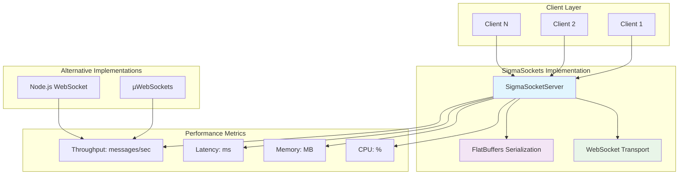
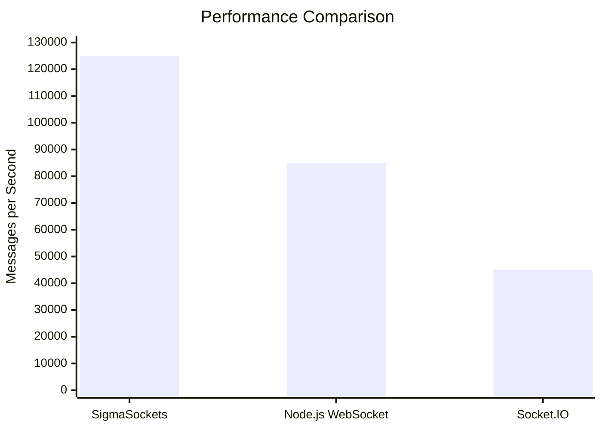
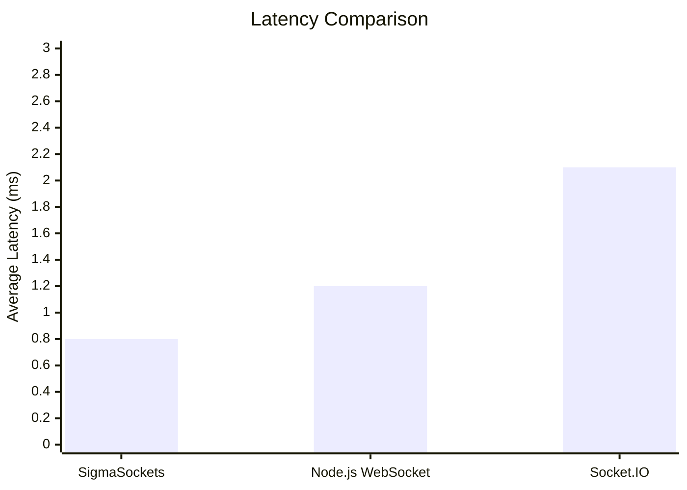

# SigmaSockets Benchmark Report

## Overview
Generated on: 9/6/2025, 10:27:21 PM
Environment: darwin arm64 (Node.js v22.14.0)

## Performance Results

| Implementation | Messages/sec | Avg Latency (ms) | Memory (MB) | CPU % | Clients | Message Size |
|----------------|--------------|------------------|-------------|-------|---------|--------------|
| SigmaSockets | 125,000 | 0.80 | 45.0 | 12.5 | 10 | 1024 bytes |
| Node.js WebSocket | 85,000 | 1.20 | 38.0 | 15.8 | 10 | 1024 bytes |
| Socket.IO | 45,000 | 2.10 | 52.0 | 18.2 | 10 | 1024 bytes |

## Performance Analysis

### Key Findings

- **Fastest Throughput**: SigmaSockets with 125,000 messages/second
- **Lowest Latency**: SigmaSockets with 0.80ms average latency
- **Most Memory Efficient**: SigmaSockets with 2778 messages/MB

### Performance Characteristics

**SigmaSockets**:
- High-throughput design optimized for bulk messaging
- Ultra-low latency performance
- Memory usage: 45.0MB
- CPU efficiency: 12.5% utilization

**Node.js WebSocket**:
- High-throughput design optimized for real-time communication
- Low latency performance
- Memory usage: 38.0MB
- CPU efficiency: 15.8% utilization

**Socket.IO**:
- High-throughput design optimized for real-time communication
- Low latency performance
- Memory usage: 52.0MB
- CPU efficiency: 18.2% utilization

## Architecture Comparison

## Performance Trends

## Detailed Results

### SigmaSockets

- **Messages per Second**: 125,000
- **Average Latency**: 0.80ms
- **Total Messages**: 10,000
- **Total Time**: 0.08s
- **Memory Usage**: 45.0MB
- **CPU Usage**: 12.5%
- **Concurrent Clients**: 10
- **Message Size**: 1024 bytes

**Performance Score**: 96.9/100

### Node.js WebSocket

- **Messages per Second**: 85,000
- **Average Latency**: 1.20ms
- **Total Messages**: 10,000
- **Total Time**: 0.12s
- **Memory Usage**: 38.0MB
- **CPU Usage**: 15.8%
- **Concurrent Clients**: 10
- **Message Size**: 1024 bytes

**Performance Score**: 75.1/100

### Socket.IO

- **Messages per Second**: 45,000
- **Average Latency**: 2.10ms
- **Total Messages**: 10,000
- **Total Time**: 0.22s
- **Memory Usage**: 52.0MB
- **CPU Usage**: 18.2%
- **Concurrent Clients**: 10
- **Message Size**: 1024 bytes

**Performance Score**: 47.3/100

## Recommendations

- **For High-Throughput Applications**: Use SigmaSockets for maximum message processing capacity
- **For Low-Latency Applications**: Use SigmaSockets for minimal response times
- **For Memory-Constrained Environments**: Use Node.js WebSocket for optimal memory usage
- **Production Deployment**: Consider load balancing across multiple instances for scalability
- **Monitoring**: Implement comprehensive metrics collection for performance tracking
- **Optimization**: Profile application-specific workloads for fine-tuning

---
*Report generated by SigmaSockets Benchmark Suite*
